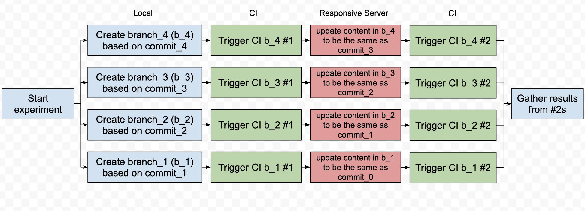

# CIReinteract

This is the repository for the CS598DM project, which provides researchers a tool to perform experiments on Regression Test Selection in a Continuous Intergration environment.

Note tht the tool name doesn't reflect the intension of the tool, so please read the [motivation](#Motivation) carefully to see if the tool actually fits your need.

## Scope of the Project

The project is focusing on RTS tools which can be included into Java projects by configuring `pom.xml` file. And the CI environment is Travis-CI. Thus in the rest of the README, RTS tools and CI will refer to both the general concept and the features related to this kind of RTS tools and Travis-CI.

## Background

Regression Testing (RT) is commonly used in industry to provide a comprehensive verification on the integrity of the software. In other words, it runs all existing test cases to make sure that the code change doesn't break the existing functionalities.

However, since regression testing runs all test cases, it is obvious that it can be time consuming for large scale projects. Regarding to this, another intuition is that it is most likely that only a subset of the test cases are affected by this code change. Thus, researchers came up with the concept of Regression Test Selection (RTS), where exists an oracle (or an approximation of it) to provide information about what are the affected tests that are sufficient and necessary for the verification.

There are many RTS tools that are created over the years, however, they are designed for running on local machines, while the regression testing schema has changed as the code base is growing larger and larger. Nowaday, the task of performing regression testing is often moved over to Continous Intergration (CI) environment where the task will be distributed among a group of remote machine. In this way, the computation resource on local machine will be preserved for development and thus the productivity of the developer will not be compromised. Different companies may use different CI environments, which is beyond the scope of this project. However, for open source projects, especially those on GitHub, they often uses Travis-CI for continous intergration. Given this reason, even though there are a variety of other CI tools (Semaphore, Jenkins, etc.), Travis-CI will be the CI enviroenment that this project is focus on.

## Motivation

Realising the change of regression testing schema, it is interesting to conduct RTS experiments in CI environment and to compare the gain of using RTS tools with CI. However, due to the distributed nature of CI, many RTS tools that rely on generated artifacts between run will not be able to work properly without further configuration. As a result, this tool is created to:

1. Simplify the work of modifying the project configuration to use RTS tools in CI environment.
2. Initiate a series of experiment runs at commit basis such that the run results provided by CI environment will reflect the effectness of the RTS tools
3. Utilize the Git branch feature such that the experimental runs can be run parallelly

So the tool is a good fit for you if you are:

* Developer who wants to have statiscal insight on how much RTS tools can benefit your projects that uses CI.
* Researcher who wants to test and compare the RTS tools available for study about RTS tools on CI.

If you already decide to incorporate RTS tool into your project and what to know how to let it work on CI, check out the [Before Pipeline](#Before-Pipeline) section.

## Usage

The provided code in the repository is developed for:

* Ekstazi and STARTS as RTS tools
* Travis-CI as CI environment
* Azure functions as responsive server

If the above setting satisfies your need, you can directly use the tool as the following. You will want to provide your customized component if you want to use different RTS tools, different CI environment or different responsive server. You will know what are the additional component you need to provide once you read the [workflow](#workflow) and the engineering detail it mentions.

### Set Up Responsive Server

Set up your Azure function with the two endpoints included in `azure_function_code`, note that `Environment.GetEnvironmentVariable("STORAGE_CONNECTION")` used in both endpoints are environment variable related to your cloud storage, thus you also need to set up your Azure blob storage and add the connection string to your Azure function.

[Azure Funtion Overview](https://docs.microsoft.com/en-us/azure/azure-functions/functions-overview)

[Azure Blob Storage Overview](https://docs.microsoft.com/en-us/azure/storage/blobs/storage-blobs-introduction)

### Configure Local Portion of the Pipeline

On your local machine:

``` bash
export REPO_BASE="/path/to/directory/contains/all/git/repository"
```

For instance, if there is a git direcotry on your local machine `/home/some_folder/git_repo`, you will use `export REPO_BASE=/home/some_folder`. The idea is that you can initiate the same experiment for multiple repositories in one pass as the tool will perform the same operations for all git repositories inside the directory.

Update the `WEBHOOK_ENTRY` and `REPORT_STORAGE_ENTRY` with the URLs of the Azure endpoints in `src/SetupManager/constants.py`

### Start the Pipeline

``` bash
python src/decomposeRepo.py [-c]
```

`[-c]` option indicates if you want to delete the additional branches created for experiment if they exists. You may want to use this option if you want to restart the experiment as if it has never been run before.

## Workflow

### Before Pipeline

To use RTS tools on CI, there are two steps to you need to follow:

* Include the RTS tool in your project
* Configure CI to cache the RTS artifacts
* Configure CI to send notification to external endpoint (for experiment purpose only, see detail below)

For RTS tools that are in Maven Central, the first step is as simple as including the RTS plugin in your `pom.xml` files. Of course you also need to satisfy the dependencies of the tool (i.e. STARTS requires surefire to be explicitly included in `pom.xml`). ([engineering detail](./src/SetupManager/setupFunctions.py))

The second step is necessary based on the assumption that RTS tools rely on generated artifacts from previous run. Because of the distributed nature of CI, without further configuration, you have to assume that each CI build is independent to each other, and thus RTS tool won't work properly. In order to use RTS tools on CI, you need to configure the CI setting (modifying `.travis.yml` in the case of Travis-CI) to cache the RTS artifacts and restore them in the subsequent CI build. ([engineering detail](./src/SetupManager/setupFunctions.py))

The third step is for completing the pipeline (see [pipeline detail](./documentation_assets/pipeline_detail.md)) and gathering experiment results. As the pipeline will generate a series of builds, we will want to let CI to export the results to external endpoint where we can perform further filtering and storing. There are two kind of data that we are interested in, one is the build time and build status, which will be generated and sent via [Travis-CI's webhook feature](https://docs.travis-ci.com/user/notifications#webhooks-delivery-format), and the other is the detail test results, which will be generated as surefire-report. ([engineering detail](./src/SetupManager/setupFunctions.py))

### Pipeline

I desgined the following pipeline to perform RTS experiments on CI, I separate the detail explaination to [pipeline detail](./documentation_assets/pipeline_detail.md) due to the length of the content.



With the third step in [Before Pipeline](#Before-Pipeline) configured, the responsive server (I used Azure function for the work) will receive notification whenever a CI build is finished. So it is important for the server to analyze the payload sent by CI and determine if the notification indicates that the content in the corresponding branch should be updated. ([engineering detail](./azure_function_code/CINotificationEndpoint.csx))

### After Pipeline

After the pipeline is completed (no CI build is running), we can gather the results recorded and stored via the storage endpoint. With the storage endpoint I implemented ([engineering detail](./src/SetupManager/setupFunctions.py) and [the second part of engineering detail](./azure_function_code/CINotificationEndpoint.csx)), the reports are stored as the following:


With those results, it is up to the developer and the researcher to analyze them for their need.

## Customization

As a summary, if you want to provide support on:

* Different RTS tool:
  * Provide your own `rts_setup_function` as in `src/SetupManger/setupFunctions.py`, which will takes a string of path to repository as argument and return a list of files that are modified. Such that once the function is called, the project will be able to run with the provided RTS tool.
* Different CI environemnt
  * Provide your own `ci_setup_function` as in `src/SetupManger/setupFunctions.py`, which will takes a string of path to repository as argument and return a list of files that are modified.
  Such that once the function is called, the RTS tool will work properly in designated CI environment.
  * Note that the `ci_setup_function` should also configure the CI environment to send notification of build completion to the notification endpoint and to upload the test reports to the storage endpoint.
* Different responsive server
  * Set up the designated server endpoints and modify the `ci_setup_function` you are using to send notification and test reports to the new endpoints.

## RTS Tool Support

* Ekstazi
* STARTS

## CI Support

* Travis-ci