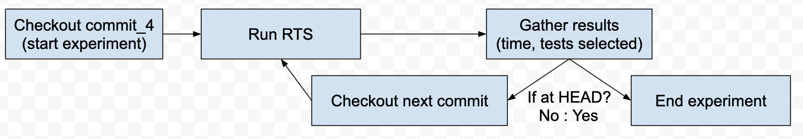
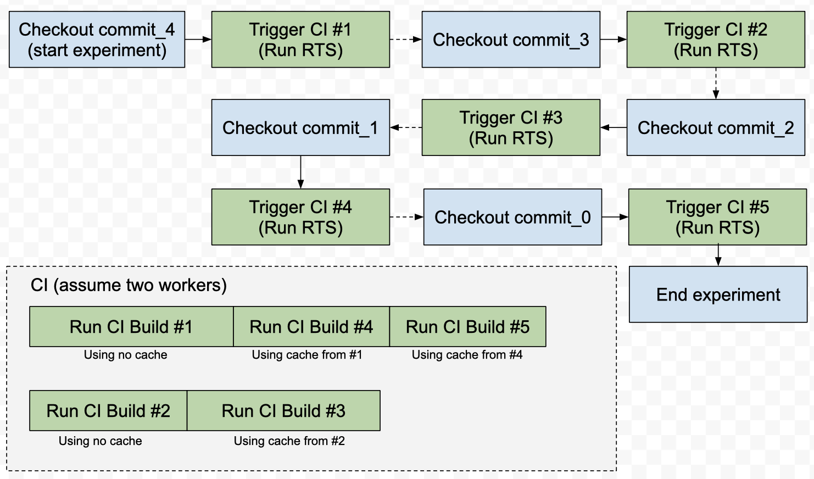
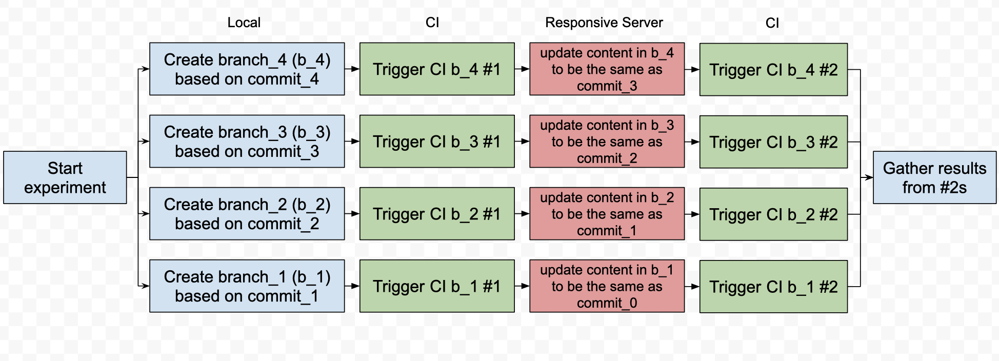

# Pipeline Detail

## Conceptual Detail

In a typical RTS experiemnt (at least my view of it), the researcher (or the script he/her wrote) will run the RTS tool on a given project, gather run result, update the code base to the next version (commit in terms of Git), and repeat. If we assume that there is an imaginary project with 5 commits in it (from oldest to newest: commit_4, commit_3, commit_2, commit_1, commit_0), the pipeline will be illustrated as below:

However, this pipeline can't be adopted to Travis-CI trivially because this pipeline implicitly rely on the notification of "the current RTS run is finished and it is time to proceed". As a result, it requires some kind of server to be able to receive notification from Travis-CI and to proceed the experiment. And there is no way to avoid setting up such server due to the distributed nature of Travis-CI where Travis-CI will run the builds in parallel. In other words, even you try to roll out the pipeline and trigger Travis build at each critical point ("run RTS"), the build for a later commit may be run before the earlier commit. In this case, the RTS artifacts are not generated properly and the run results will not be valid, as illustrated below:

Indeed, the parallelization feature of Travis-CI induces additional conponent in the pipeline (responsive server), but can we still utilize this feature in our pipeline? The answer is yes. Notice that the RTS runs only rely on the cache of the RTS artifacts in the previous commit. In other words, for RTS to work properly for commit_3, the RTS artifacts generated by running RTS only on commit_4 is as sufficient as those generated running RTS on commit_5 and then on commit_4. With the knowledge that the CI cache is preserved at branch basis, I designed the following pipeline:

Notice that the number of CI build increases for breaking the dependency, but the actual elapsed time will decrease according to number of CI workers in exchange. Also note that the first CI build on each branch is merely for generating corresponding RTS artifacts, we only use the results from the second runs for analysis.

## Engineering Detail

Given a git project on your local machine, the tool will:

* Decompose the git repository into numorous branches by commit history, each generated branch, `seed_#`, will represent the repository status at # commits away from master HEAD.
* Create new branches out of each "seed" branch for the RTS tool being examined, `{tool's name}_seed_#` and `{tool's name}_#-(#-1)`. In the new branches, the CI configuration and build configuration will be modified to run the RTS tool. **Those branches are "b_#" shown in the conceptual diagram above.**
* After the CI build are completed on `{tool's name}_#-(#-1)` branches, those branches' commit history will be "incremented" by merging corresponding `{tool's name}_seed_(#-1)` branch. **This is done by responsive server shown in the conceptual diagram.** In this way, each `{tool's name}_#-(#-1)` branch simulates the development behavior of making a new commit (#-1) and using RTS tool to check the correctness.

Therefore, the CI results of `{tool's name}_seed_(#-1)` branches can be used to examine the effect of the RTS tool. Similarly, the last two points described above can apply to other RTS tools simultaneously to generate results programatically.